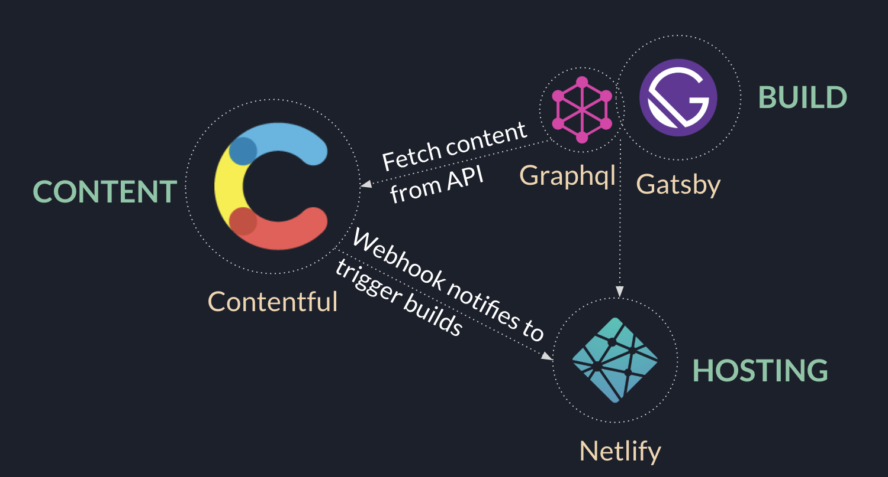

### JAMStack / JavaScript, APIs, and Markup

Developers are making tons of decision while developing the
applications. Selecting the web stack according to your
application needs is one of critical decisions. While some
developers stick with traditional web stacks, some of them
exploring the new ways to make future application efficent, fast
and cost effective.

JAMStack is one of the trending technologies that simplifies the development process and meanwhile giving fast and secure Progressive Web Application as a product. The most popular three main frameworks for JAMStack applications according to GitHub as follows, [Next.js](https://nextjs.org/), [HUGO](https://gohugo.io/) and [Gatsby](https://www.gatsbyjs.com/).

### WHY and WHEN JAMStack?

As mentioned, JAMStack is a modern way of building websites & apps. Let's breakdown it to understand better what's going on behind of the curtain.

**JavaScript:** Basically all dynamism of the JAMStack comes from JavaScript, it runs on the client side and it handles all client side requests/responses.

**APIs:** All server-side and database actions that are part of any regular web stack transformed into reusable APIs. These APIs are accesed by JavaScript using HTTPS and they might be custom built or a 3rd party SaaS.

**Markup:** This is basically templates of web pages and all content is pulled from APIs gathered together by static site generator at a [build time](https://www.gatsbyjs.com/docs/overview-of-the-gatsby-build-process/) and static files generated.

### Pros

#### Fast

JAMstack sites are super fast because the HTML is already
generated during deploy time and just served via CDN without any
interference or backend delays.

#### Highly Secured

Everything works via an API and hence there are no database or
security breaches.its server-side processes abstracted into micro
service APIs, surface areas for attacks are reduced and so your
site becomes highly secured.

#### Cheaper & Easier Scalability

JAMstack sites only contain just a few files with minimal sizes
that can be served anywhere. Scaling is a matter of serving those
files somewhere else or via CDNs.

### Cons

There are two major disadvantanges of JAMstack which should be considered before choosing your technology stack and architecture.

#### JAMstack is not suitable if you have daily multiple updates

In JAMstack environment update means basically rebuilt of the static files (HTML, CSS, JS). Built time corelated with scale of application and this will lead to time consuming built time for especially large scale applications. Thus, this technology has a down side if you frequently update your content in your database. Also another down side is changing templates which requires a developer to make all changes in your template files inside of your application.

#### JAMstack is dependent of third party APIs

Third party APIs are in the nature of Jamstack and they're being used for bringing lots functionalities such as [authentication](https://auth0.com/), [media storage](https://cloudinary.com/) and etc.
Even having these services in your application means consistentency and security for your environment, being dependent on third party system might have some downsides as well. For instance in case of any third party api/system goes down, there is nothing to do rather than waiting for the third party service to fix the problem.

[More Detail](https://buttercms.com/blog/jamstack-vs-mean-vs-lamp-your-guide-to-picking-one "More Detail")
