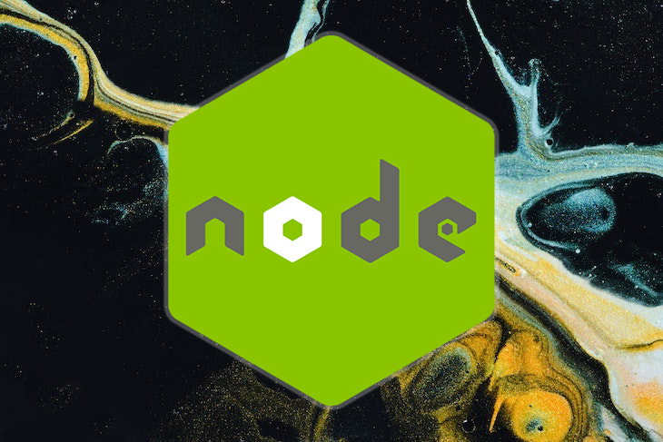
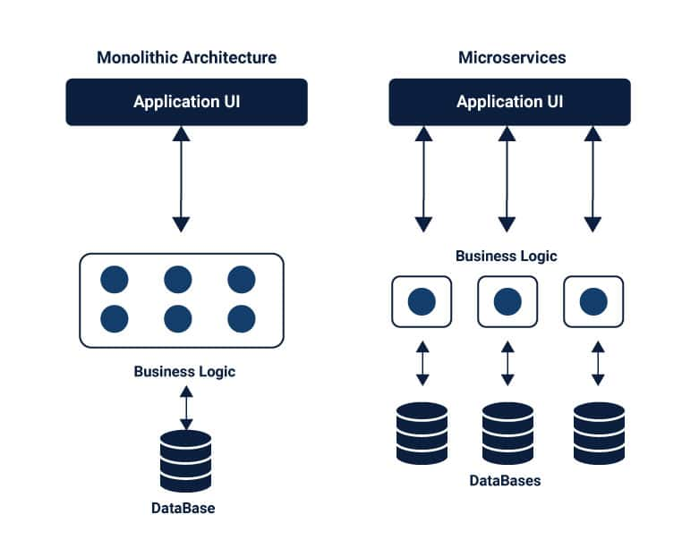

### Building Scalable Node.js Microservices with TypeScript and the CQRS Pattern

In today's fast-paced, digital world, businesses rely on software to drive their operations and interact with customers. As a result, the demands on software systems are constantly increasing, and the ability to scale and adapt quickly is crucial. One way to achieve this is by adopting microservices architecture.

    
    
Retrieved from <a style="font-style:italic;" href="https://blog.logrocket.com/building-microservices-node-js/" target="_blank">Building microservices with Node.js<a>

### What are Microservices?

Microservices are a software design pattern in which a large application is broken down into smaller, independent units that can be developed, deployed, and maintained separately. Each microservice is responsible for a specific task or set of tasks and communicates with other microservices through APIs.

The main advantage of microservices is that they allow for greater flexibility and scalability. Because each microservice is independent, it can be developed and deployed separately, which means that changes to one microservice won't necessarily affect the others. This also makes it easier to scale specific microservices as needed, rather than scaling the entire application.

### The CQRS Pattern

    
    
Retrieved from <a style="font-style:italic;" href="https://learn.microsoft.com/en-us/previous-versions/msp-n-p/jj591573(v=pandp.10)" target="_blank">Introducing the Command Query Responsibility Segregation Pattern<a>

One key aspect of building scalable microservices is to adopt a suitable design pattern. One such pattern is Command and Query Responsibility Segregation (CQRS). CQRS is a pattern that separates the read and write operations in a system into separate models.

In a traditional monolithic application, read and write operations are often combined in the same model. This can lead to performance issues as the system grows and the number of read and write operations increases. With CQRS, the read and write operations are separated into two different models, which allows for greater scalability and performance.

### Why Use TypeScript for Node.js Microservices?
TypeScript is a typed superset of JavaScript that adds optional static typing to the language. This can be especially beneficial when building microservices, as it can help to catch errors earlier in the development process and make the code easier to maintain and understand.

Some of the main benefits of using TypeScript for Node.js microservices include:

Improved code quality: TypeScript's static typing helps to catch errors at compile time, rather than runtime. This can help to reduce the number of bugs in your code and improve the overall quality of your microservice.

Enhanced code readability: TypeScript's type annotations make it easier to understand the purpose and behavior of different parts of your code. This can make it easier for new team members to get up to speed and for everyone to understand the codebase.

Better scalability: TypeScript's type system helps to ensure that your code is well-structured and easy to maintain. This can make it easier to scale your microservice as your system grows and evolves.

Overall, using TypeScript for Node.js microservices can help to improve the quality, readability, and scalability of your code. While it does add an additional step to the development process (compiling the TypeScript code to JavaScript), the benefits can make it well worth the effort.

### Shortcomings of Monolithic Applications

While monolithic applications have been the norm for many years, they have several shortcomings that can make them difficult to scale and maintain as the system grows.

One major issue with monolithic applications is that they are often difficult to understand and navigate. Because all of the code is contained in a single codebase, it can be challenging to understand the relationships between different parts of the code and how they fit together. This can make it difficult to make changes or add new features to the system.

Another issue with monolithic applications is that they are difficult to scale. If one part of the system becomes slow or overloaded, it can affect the entire application. This can lead to poor performance and customer satisfaction.

    
    
Retrieved from <a style="font-style:italic;" href="https://www.cuelogic.com/blog/microservices-with-node-js" target="_blank">How to build a microservices architecture with Node.Js to achieve scale?<a>

### Advantages and Challenges of Microservices

While microservices have many advantages, they also come with their own set of challenges.

One major advantage of microservices is that they are easier to understand and maintain. Because each microservice is responsible for a specific task, it is easier to understand how it fits into the overall system. This also makes it easier to make changes or add new features to the system.

Another advantage of microservices is that they are easier to scale. Because each microservice is independent, it can be scaled separately as needed. This allows for greater flexibility and the ability to scale specific parts of the system as needed.

However, microservices also come with their own set of challenges. One major challenge is the complexity of managing and coordinating multiple microservices. Because each microservice is independent, it is important to have a clear understanding of how they interact and communicate with each other. This can be difficult to manage as the number of microservices increases.

Another challenge is the added complexity of deployment. With monolithic applications, deployment is typically straightforward, as it is just a matter of deploying the entire application as a single unit. With microservices, however, deployment becomes more complex because each microservice must be deployed separately. This requires more coordination and management, as well as a clear understanding of how the microservices interact and communicate with each other.

### Deployment Options for Node.js Microservice Applications

Once you have built your Node.js microservice application, the next step is to deploy it. There are a number of options for deploying Node.js microservices, including:

Deploying to a cloud platform: Cloud platforms like Amazon Web Services (AWS), Microsoft Azure, and Google Cloud offer a variety of services for deploying and scaling microservices. These platforms provide tools for deploying and managing microservices, as well as scalability and high availability.

Deploying to a container platform: Container platforms like Docker and Kubernetes allow you to package your microservices into containers, which can be easily deployed and scaled across a distributed system. This can be a good option if you want more control over your deployment environment.

Deploying to a hybrid cloud: A hybrid cloud is a combination of a private cloud (on-premises or data center) and a public cloud. This can be a good option if you want to take advantage of the scalability and reliability of the cloud, but also need to maintain control over certain parts of the system.

No matter which option you choose, it is important to carefully consider your deployment needs and choose the option that best fits your requirements.

In conclusion, microservices are a powerful software design pattern that can help businesses build scalable and flexible software systems. By adopting the CQRS pattern and carefully considering your deployment options, you can build and deploy scalable Node.js/TypeScript backend microservices that drive your business forward.
