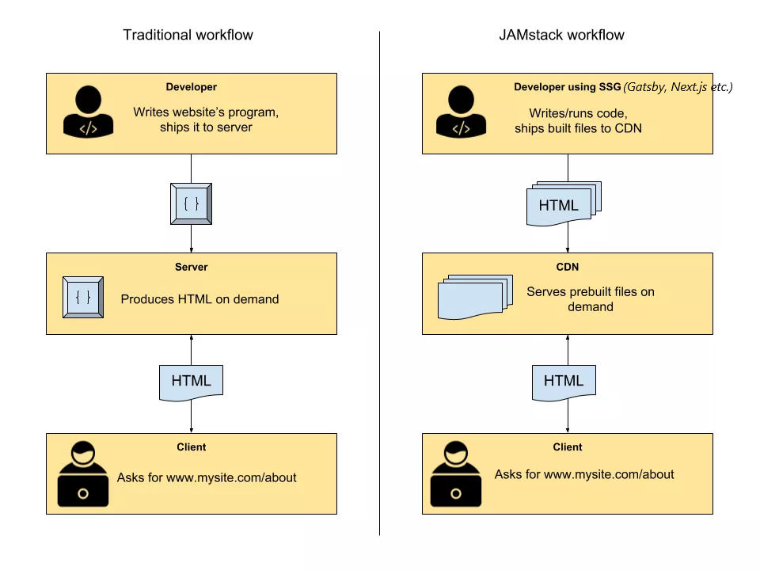

### JAMStack / JavaScript, APIs, and Markup

Developers are making tons of decisions while developing applications. Selecting the web stack according to your application needs are one of the critical decisions. While some developers stick with traditional web stacks, some of them exploring the new ways to make future application efficient, fast and cost-effective.

JAMStack is one of the trending technologies that simplify the development process and meanwhile giving fast and secure Progressive Web Application as a product. The most popular three main frameworks for JAMStack applications according to GitHub as follows, [Next.js](https://nextjs.org/), [HUGO](https://gohugo.io/) and [Gatsby](https://www.gatsbyjs.com/).

### WHY and WHEN JAMStack?

As mentioned, JAMStack is a modern way of building websites & apps. Let's breakdown it to understand better what's going on behind the curtain.

**JavaScript:** All dynamism of the JAMStack comes from JavaScript which runs on the client-side and handles all client-side requests/responses.

**APIs:** All server-side and database actions that are part of any regular web stack transformed into reusable APIs. These APIs are accessed by JavaScript using HTTPS. They might be custom-built or a 3rd party SaaS such as headless CMS.

**Markup:** These are templates of web pages and all content pulled from third party APIs gathered together by a static site generator at a [build time](https://www.gatsbyjs.com/docs/overview-of-the-gatsby-build-process/) and static files generated.

### Pros

#### Fast

JAMstack sites are super fast because the HTML is already
generated during deploy time and just served via CDN without any
interference or backend delays.

#### Highly Secured

Hence everything works via an API there are no database or security breaches. Server-side processes abstracted into microservice APIs which reduces surface areas for attacks. Therefore your site becomes highly secured thanks to this feature.

#### Cheaper & Easier Scalability

JAMstack sites only contain just a few files with minimal sizes
that can be served anywhere. Scaling is a matter of serving those
files somewhere else or via CDNs.

### Cons

There are two disadvantages of JAMstack that should be considered before choosing your technology stack and architecture.

#### JAMstack is not suitable if you have daily multiple updates

In the JAMstack environment, the update means rebuilt of the static files (HTML, CSS, JS). Built time correlates with the scale of application and this leads to time-consuming built time for large scale applications. Thus, this technology has a downside if you frequently update your content in your database. Also, changing the templates is another downside of the Jamstack which require a developer to make all changes in your template files inside of your application.

#### JAMstack is dependent of third party APIs

Third-party APIs are part of Jamstack and they're being used for bringing lots of functionalities such as [authentication](https://auth0.com/), [media storage](https://cloudinary.com/), etc.
Even having these services in your application means consistency and security for your environment. However, being dependent on a third party system might have some downsides as well. For instance, in case of any down third party API/system, there is nothing to do rather than waiting for the third party service to fix the problem.

#### Resources

- [JAMStack vs MEAN vs LAMP: Your Guide to Picking One](https://buttercms.com/blog/jamstack-vs-mean-vs-lamp-your-guide-to-picking-one)
