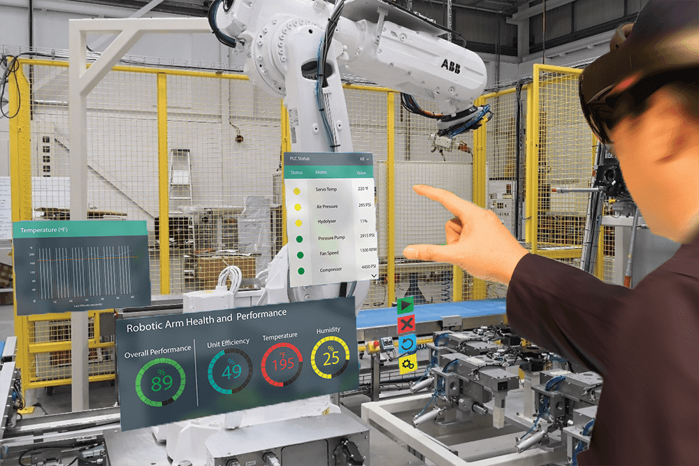

You are buying a shirt and trying a couple of shirts to determine which one is more suitable for you. Or visit the Porto apartments you want to rent this summer. Or, if you are buying a new chair on the digital market, and you want to see how it looks in the living room. These are all possible solutions that we may encounter in one place or another. Now imagine that you can do this comfortably at home without having to visit any of these places. What are the gains? AR and VR applications.

Augmented reality (AR) and virtual reality (VR) are twin technologies that are trending this year. From the opening ceremony of the Olympic Games to the Consumer Electronics Show (CES) in Las Vegas last month, tech giants such as Facebook, Google, Lenovo and HTC showed off their equipment. It is foreseeable that Amazon intends to join this game, and there are rumors that it will explore AR, and Samsung is also developing products.
AR and VR merge the boundary between the physical world and the digital world. They allow new ways to interact with users, fellows and the world around us. Most of us don’t know a much difference between AR and VR. Both these technologies have huge market potential and is only in the early stages of unlocking.

### AR Market Expansion

According to Digi-Capital's basic " Augmented/Virtual Reality Report Q2 2015", the AR/VR market will expand to USD 150 billion by 2020. In addition, augmented reality has the largest share of the USD 120 billion.
The latest market research provided by Juniper Research shows that the enterprise and industrial markets will seize a market share of US$2.4 billion in 2019. Compared with 2014's $247 million, the gap between the two is very impressive!

### Uses of Augmented Reality

AR will change the Business experience completely in every aspect, like from the way of investment to the way of selling. In AR based business you have to invest more in you AR-enabled APP and then you will sell on that app.
Augmented reality is applicable to various industries. Following are the most interesting industries.

#### 1. Education and Training

Bringing augmented reality technology into the classroom can make education more attractive and interactive, and even make the most boring subjects interesting. If students can download and access the apps on the phones, then they can get more detailed information about the things that they never understand. For example, if the students of Intermediate are taught on AR gadgets, then they can see how the Mitosis and miosis occurs and how the water flows inside the plant etc. The MBBS students can try their first surgery without harming the patient, and future astronauts can prepare for the next space flight.

#### 2. Retail

In the retail industry, there are countless opportunities for augmented reality. There can be two possibilities one is in-store experience and the other is out-of-store experience. In the in-store experience the customers will use the AR technology within the walls of store. This can be a virtual fitting room which is going to help the customers determining the size or color of the product. Out-of-store experience means that your customers can experience it without having to leave home. Just like Converse's Sampler app, it allows customers to try on a pair of sneakers to choose their favorite models. eBay Inc. recently announced that it is developing AR toolkits to make shopping more fun and efficient. For example, it will allow the seller to choose the appropriate box size for the product by overlaying the image of the box on the product.

#### 3. Real Estate

As all of us knows well, that the internet is the best place for home buyers and renters to find a home according to their choice, so AR has a lot of benefits in real estate business. Using AR buyers can explore homes by just sitting on their Couche, filter out the houses they like and dislike, and save a lot of their time. AR is also very useful for construction workers. They can provide vivid blueprints and Animated video to make them clear about the design of their building.

#### 4. Interior Design

AR can help you in making right decision about the size and style of new furniture you are planning to buy or trying to buy. Moreover, anyone can see that how that particular furniture will look in room. The most common example of this AR use is the Swedish retail giant IKEA and its IKEA Place AR application.

[More Detail](https://teamar.ca/ "More Detail")
