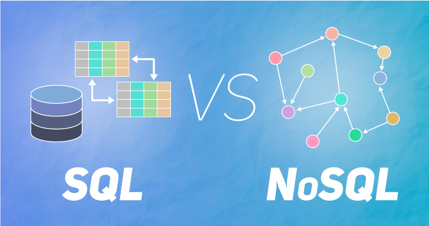
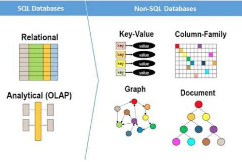

When you start a new project, "How are you going to store the data?" is one of the main questions. To answer this, we should evaluate our project in terms of data structure, scale, query complexity, and schema flexibility. So I'll explain how each factor works for SQL and NoSQL databases and clarify the decision algorithm for this task at the end of this article.

Retrieved from <a href="https://www.geeksforgeeks.org" target="_blank">GeeksforGeeks<a>

#### SQL and NoSQL Data Structures

SQL stands for "Structured Querry Language" which means storing data by well-structured tables and these tables connected with relations. These relations are provided by a bunch of keys such as primary&foreign keys. When we query the data, we sometimes use these relations and the keys as well.

When it comes to NoSQL(Not only SQL), there is tons of flexibility and dynamism with data. However, there is no relation at all between collections (basically tables in SQL). These collections consist of data objects(JSON or BSON objects) and, they remind more dynamic versions of table fields in SQL.

Retrieved from <a href="https://www.thorntech.com" target="_blank">Thorntech<a>

### Scalability Of SQL and NoSQL Databases

SQL and NoSQL databases scale differently, so you're going to have to understand " How your data set is going to expand in the future? ".

SQL databases scale vertically, meaning that to scale the database, you'll need to increase the capacity of a single server (increasing the CPU, RAM, or SSD). To preserve the integrity of the data, SQL databases have been built to operate on a single server, so they are not easy to scale.

NoSQL databases expand horizontally, which ensures that more servers can be added to power the growing database. This is a huge advantage NoSQL has over SQL in terms of large scale applications.

### Query Complexity & Schema Flexibility

The next thing to consider is how much your information will be queried, how easily you need to run queries, and who is responsible for running these queries.

Since your information is nicely structured and ordered, complex queries are often used in a SQL database.

SQL is a popular language for programming that has been around for more than 45 years, so it is highly mature and well-known. It effectively executes queries and rapidly retrieves and edits data. It's very light and declarative, so it's very easy to understand. Cause of having "Structured Query Syntax", it also less differs trough out different database engines.

On the other hand, NoSQL databases have complex unstructured data schemas, and data is stored in several ways: they can be column-oriented, document-oriented, graph-based, or organized as a key -value store.

_You do not need to define their structre and you can grow your structre as you go_

_Each document can have its own unique structure_

_There is no standard for syntax_

### When You Should Go With SQL

As mentioned above, SQL databases are the perfect match for applications such as customer relationship management tools, accounting software, and e-commerce platforms that are transaction-oriented. Each row is a separate entity (e.g. a client) in a SQL database, and each column is an attribute that defines that entity (e.g. address, job title, item purchased, etc.).

Due to these distinct, structured relationships in a table between rows and columns, when you need ACID compliance, SQL databases are best. ACID stands for:

**Atomicity:** – each transaction either succeeds completely or is fully rolled back. 
**Consistency:** – data written to a database must be valid according to all defined rules. 
**Isolation:** – When transactions are run concurrently, they do not contend with each other, and act as if they were being run sequentially. 
**Durability:** – Once a transaction has been committed to the database, it is considered permanent, even in the event of a system failure. 

ACID compliance protects the integrity of your records, this is crucial for transactions required databases. SQL database provides us precise columns and rows with perfect synchronization. This will prevent mistakes and ensures transaction validity.

If your data is well organized and ACID compliance is a must, a SQL database is a solution for your project.

### What's NoSQL Best For

A NoSQL database is a much better fit for storing information that would not fit neatly into a table, such as an article content, social media messages, sensor data, and other forms of unstructured data. With simplicity and scalability in mind, NoSQL databases have been constructed and adopt the BASE consistency model, which means:

**Basic Availability:** This means even database database ensures the availability of the data, you may not able access data, in case of a changing or inconsistent data structre. 

**Soft State:** The state of the database can change over time.</b

**Eventual Consistency:** Eventually, the database will become consistent, and at some stage in the future, data will spread everywhere. 

The most important factor in deciding whether to use a SQL or NoSQL database is the architecture of your data, so before making a decision, it should be considered.

_Just for heads up, There are also some NoSQL databases that are ACID compliant. You can read more about [here](https://blog.yugabyte.com/6-signs-you-might-be-misunderstanding-acid-transactions-in-distributed-databases/)._

#### Resources

- [MongoDB vs. MySQL](https://dzone.com/articles/comparing-mongodb-amp-mysql)
- [SQL vs NoSQL – What’s the best option for your database needs?](https://www.thorntech.com/2019/03/sql-vs-nosql/)
- [SQL vs NoSQL: Which one is better to use?](https://www.geeksforgeeks.org/sql-vs-nosql-which-one-is-better-to-use/)
- [SQL vs NoSQL: 5 Critical Differences](https://www.xplenty.com/blog/the-sql-vs-nosql-difference/)
