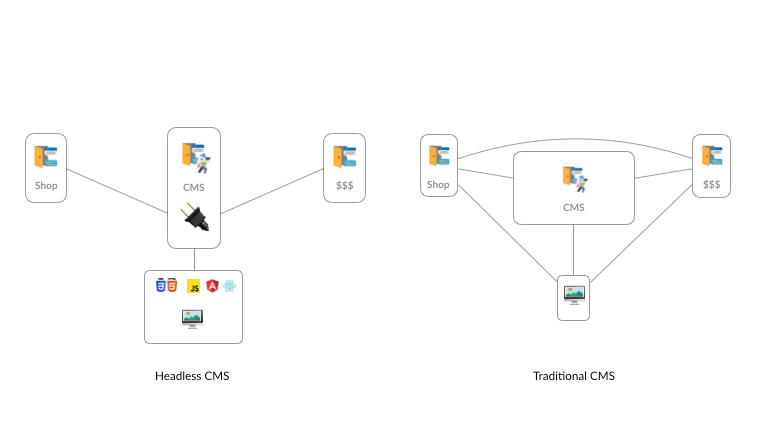

If you're a developer using trending technologies for your front end like React, Vue, Angular or Gatsby, Next.Js, etc., then there is a chance that you might have heard the new CMS type called headless CMS.
But what's the real difference between monolithic CMSs and headless CMS rather than names?
First, let me remind you of monolithic CMSs' structures, and afterward, we will be comparing that with headless CMS.

### Monolithic CMS

In monolithic CMSs' nature, the presentation layer (head) is coupled to CMS. In the monolithic CMS approach, users can add/edit the content independently without compromising the overall design. Besides, the CMS serves both the back and front end, and as you guess, "monolithic" comes from this point. This approach is pretty standard on the internet. For instance, WordPress, a monolithic CMS, is the most popular CMS on the web by December 2020.

Retrieved from <a style="font-style:italic;" href="https://www.ktnv.com/now-trending/mysterious-monolith-discovered-in-remote-area-of-utah" target="_blank">KTNV LAS VEGAS<a>

As time passes, new technologies are coming up with more flexible solutions, and as technology improves, requires better systems will replace old legacy systems.

### Headless CMS

So there is a modern alternative type of CMS for these legacy systems, it's not coupled to the presentation layer(head), and for this reason, it's called headless CMS. A headless CMS is a Content Management System that allows you and members to manage and write content and then access it across your application using an API.

Retrieved from <a style="font-style:italic;" href="https://strapi.io/blog/10-reasons-headless-cms" target="_blank">10 reasons to use a headless CMS<a>

You can control the presentation layer with whichever technology you choose for the desired project goals in headless CMS.

In this article, I'll point out why I choose headless CMS Strapi over WordPress CMS for my new projects.

You can use Wordpress as a headless CMS too, [check this article.](https://medium.com/pixelmatters/from-monolithic-to-headless-how-and-why-we-adapted-our-wordpress-stack-309f0536007e)

### Why Strapi CMS in 2021

Even though I have a decent familiarity with the WordPress environment, I wouldn't recommend using WordPress as a headless CMS approach rather than mandatory situations. Check out my reasons below.

Retrieved from <a style="font-style:italic;" href="https://strapi.io/" target="_blank">Strapi<a>

#### Strapi is fast

From installation to using the admin panel, Strapi is always faster than using Worpdress. In Strapi's admin panel, it doesn't reload the page upon saving. Strapi is based on Node.js technology, which is fast, and because of WordPress made with PHP, you'll see eventually in WordPress is much slower than Strapi to deliver the same thing.

#### Strapi is more flexible

If you're a real WordPress developer, you should already have experience digging into WordPress code and modifying some parts to fit your project. In Strapi, there is no need for that kind of labour anymore, and they've thought everything. There is also no need to get an external plugin to create our content structure as we do in WordPress with the "Advanced Custom Fields" plugin.

Strapi gives us extreme flexibility with content relation features while creating our content. Afterward, it handles the data stored in the database also provides an interface to manage our content.
At the same time, our data is exposed via API for authentication rules that we set.

#### Strapi fully customizable

After you decide on your API and data structure, you can start creating content types to form your data architecture. While creating content types in Strapi, especially the Strapi Repeatable Groups feature, helps you create custom components that allow us to create rich layouts for any page in a website/application.

Besides this, Strapi is fully customizable in a deployment way as well! You can install Strapi on your server somewhere (cloud, hosting company, etc. ) and customize it according to your project needs.

#### Strapi is free

So is WordPress. Strapi is open-source and believes in the power of open-source communities! Strapi project has more than 250 contributors.

#### Resources

- [Are you looking for an alternative to WordPress?](https://strapi.io/wordpress-alternative)
- [10 reasons to use a headless CMS](https://strapi.io/blog/10-reasons-headless-cms)
