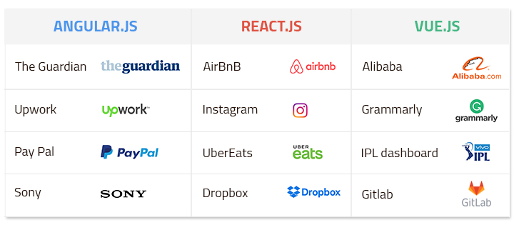

Angular, React, and Vue are all well-known JavaScript libraries and frameworks that help developers create complex, reactive, and modern web user interfaces.
I won't get into why you'd need such a framework in this article.
Instead, I'd like to discuss how those frameworks and libraries relate, as well as which of the three you might want to use for your next project.

<div>
  
  <p style="text-align:center;">Retrieved from <a style="font-style:italic;" href="https://dzone.com/articles/react-vs-angular-vs-vue-the-complete-comparison-to" target="_blank">React vs. Angular vs. Vue: The Complete Comparison<a></p>
</div>

## How to Decide

First and foremost, there is no best framework or library.
For good reasons, all three libraries are extremely popular.
They all have advantages and disadvantages, and you can use either of the libraries for any project.

In this article, we’ll look at some strengths and weaknesses, as well as "what the market says.".

But let me be clear right away: if you don't like technology, you won't be able to work with it successfully!
On the other hand, if you enjoy working with libraries, you will get a lot out of them!

## First, some context

Google created the Angular framework: Angular is also used internally by Google, so we won't see it go away overnight. It will be maintained and improved indefinitely.
Facebook created the React library: Because Facebook uses React internally, we won't see it go away overnight, and it will be maintained and improved indefinitely.
Vue is a "standalone" project not created within a company. It used to be a one-person show (founded by Evan You), but those days are long gone. It now has a dedicated team of core contributors working on Vue.

### Angular

Angular includes support for a wide range of features out of the box.
It assists you in controlling the UI, reacting to user input, validating user input in forms, routing, state management, sending Ajax Http requests, providing offline support and PWA capabilities, testing, building your application, managing multiple applications and connecting them, and much more!
Angular is fundamentally about creating reusable user interface components that you can then control with Angular and combine with other components to create an entire user interface from those Angular-controlled components.

### React

Whereas Angular provides everything, React provides only a library for rendering content to the DOM and efficiently controlling it afterward. It's also all about components and creating user interfaces, and it provides you with all of the "tools" you need to define what should be rendered in which way and under what conditions.
However, it lacks built-in form validation support. It lacks a router (to render different components based on URL changes) and does not include its HTTP client. It consists of some state management support, but not for all scenarios.

### Vue

Vue is a framework that sits somewhere between React and Angular.
It isn't as "big" as Angular, but it has more features than React.
Vue does include built-in state management as well as a router.
However, it does not include form validation or HTTP client functionality.
Like Angular and React, Vue is all about creating user interfaces by combining reusable components.
Beyond that, it provides a little more than React and a little less than Angular.

> <span style="color:black">_Note: I’ve used the term "framework" even though React.js is technically a "library"_</span>

## Let’s Get into Code

You've seen how the frameworks are conceptually similar, and let's take a look at their technical aspects now.

### Angular

Components are referred to as directives in Angular.
Directives are simply DOM element markers that Angular can track and associate with specific behaviour.
As a result, Angular separates the UI components as HTML tag attributes and their behaviours as JavaScript code.
When comparing Angular vs React, this is what distinguishes it.
Let’s check a directive example.

<div class="codeback">

```javascript
@Component({
    selector: 'app',
    template: `
    <button (click)="increment()">Increment</button>
    <button (click)="decrement()">Decrement</button>
    <div></div>
    {{counter}}
`
})
export class App {
    public counter : number = 0;

    increment(){
      this.counter += 1;
    }

    decrement(){
      this.counter -= 1;
    }
}

bootstrap(App, []);
```

</div>
</br>

Pay attention to the @Component annotation.
This is a "decorator" that tells Angular that the JavaScript class that comes after is a component.
Other features, such as services, are handled in a similar manner.
Also, the state is treated as a class member: public counter.
This is a relatively clean way of creating components on top of JavaScript's native syntax.
The interactive portion of the component is added to the button elements via the (click) directive, which is similar to the DOM method onClick but allows for method calls on the component class.
It uses the increment and decrement methods in this case.
Finally, the inline token {{counter}} allows for outputting the data-bound variable.

### React

React, interestingly, combines the UI and behaviour of components. In React, the same code creates a UI element and dictates its behaviour.

<div class="codeback">

```javascript
import React, { useState } from "react"

function Example() {
  const [count, setCount] = useState(0)

  return (
    <div>
      <p>You clicked {count} times</p>
      <button onClick={() => setCount(count + 1)}>Click me</button>
    </div>
  )
}
```

</div>

</br>

Take note of how the useState "hook" handles the state.
The template now has access to the setCount() method.
The template is written in JSX and is returned by the actual component function.
JSX allows for the inline integration of the JavaScript function into the button element's onClick attribute, which interacts with the component state.
The count token in the template markup is also used to access the state.

### Vue

When comparing Vue and React, it is worth noting that in Vue, UI and behaviour are both components, making things more intuitive.
Also, because Vue is highly customizable, you can combine the UI and behaviour of components from within a script.

<div class="codeback">

```javascript
// Define a new component called button-counter
Vue.component("button-counter", {
  data: function () {
    return {
      count: 0,
    }
  },
  template:
    '<button v-on:click="count++">You clicked me {{ count }} times.</button>',
})
```

</div>

</br>

The component is exported as a CommonJS module, as can be seen.
This is the Vue idiom for specifying component code.
The template is referred to as a template member.
The data member is a component of the object that the module exports.
This is a function that returns an object describing the state of the component.
It's worth noting that the template supports HTML with inline directives like v-on:click, which is similar to Angular's (click) or React's onClick.
The syntax for outputting bound variables in Vue is the same as in Angular: count.

### Which Framework I Should Choose

<div>

<p style="text-align:center;">Retrieved from <a style="font-style:italic;" href="https://www.angularminds.com/blog/article/comparison-between-angular-vs-react-vs-vue.html" target="_blank">Comparison Between Angular Vs React Vs Vue<a></p>
</div>

Please keep in mind that it is tough to find solutions that will work in every situation when it comes to selecting a technology to use for your next project. When starting a new project, you may encounter many different problems. Furthermore, all of the tools we discussed perform well in general and are already established technologies for developers out there.

But here's our best shot at guiding you through this decision:

### Angular

The following application types can benefit from the use of Angular.
Apps with highly dynamic content:
Because of its structure and efficient data binding, Angular is beneficial for all applications where the displayed content must be changed dynamically based on user behaviour.
Large-scale, enterprise-grade applications:
Even though Angular updates itself frequently, necessitating frequent code updates, its core structure and the tools it provides make it an excellent framework for large applications.

### React

Using this well-known framework can provide numerous benefits when dealing with:
Applications that require speed include:
React is an excellent framework for speed and performance in your application because it was designed with performance in mind and supports the virtual DOM.
Applications requiring versatility:
React can be used almost anywhere without sacrificing performance, and you don't need to use any special techniques to work on different platforms. The framework ecosystem will support you with React Native for mobile app development.
General websites that require good SEO:
React's speed and overall performance can help improve SEO in Google's eyes by providing a better user experience.
Suitable for a global audience:
Because many projects today are geared toward a global audience, you will have people accessing your application at varying speeds. Faster React apps can help you bring your product to different continents where bandwidth or hardware capabilities may be limited.

### Vue

This newly created but rapidly establishing framework is useful in many different situations, such as:
Applications that require speed:
Vue.js applications, like React, are high-speed and can improve the speed of your project.
When you need highly lightweight applications:
Vue is not only fast but also extremely light. This provides benefits such as improved performance for machines with limited resources and increased accessibility for people with slower connections.

When you want to integrate a framework into an existing app:
you can do so quickly and gradually, thanks to Vue's internal structure. In the long run, this will save time and money, making Vue a very efficient tool for startups and growing ideas.

The answer to the Angular vs. React vs. Vue debate is that there is no absolute right choice, which you probably expected.

Each of these libraries has advantages and disadvantages. One of these will be more appropriate than the others depending on the project you're working on and your individual needs. It's always important to do your research before making a decision, especially if you're working on a business venture rather than a personal project.

#### Resources

- [Angular vs React vs Vue: Which Framework to Choose in 2021](https://www.resourcifi.com/blog/react-vs-angular-vs-vue/)
- [Angular, React, Vue: JavaScript Frameworks Compared](https://www.infoworld.com/article/3606737/angular-react-vue-javascript-frameworks-compared.html)
- [Angular vs. Vue vs. React: Comparing Frameworks By Performance](https://blog.logrocket.com/angular-vs-react-vs-vue-a-performance-comparison/)
- [Angular vs React vs Vue - My Thoughts](https://academind.com/tutorials/angular-vs-react-vs-vue-my-thoughts/)
