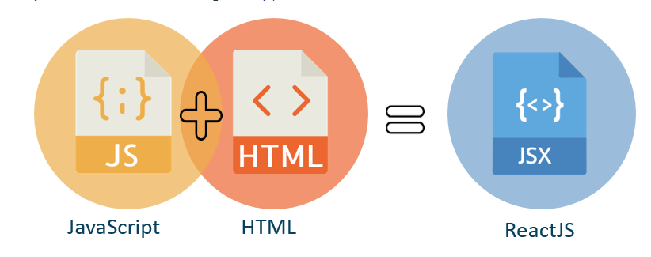
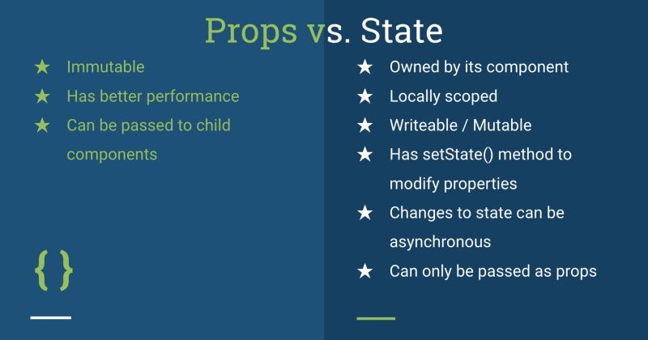
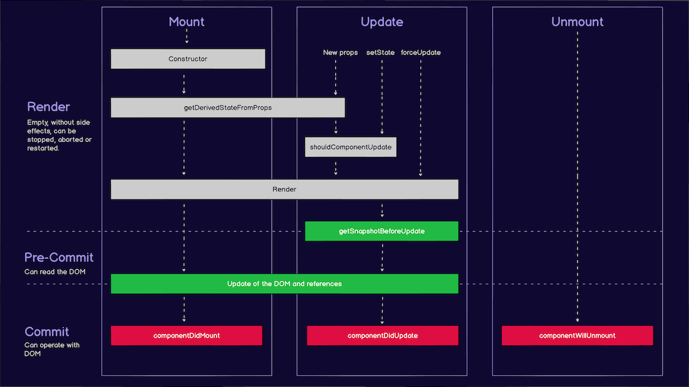

[React is a front-end library developed by Facebook.](https://reactjs.org/) It is used to manage the view layer for web and mobile apps. We can construct reusable UI components with ReactJS. It has a strong foundation and a vast community behind it, making it one of the most popular JavaScript libraries.

React is a single-page application, which means it just loads one HTML page and all of the necessary assets (such as JavaScript and CSS) for the app to run. Interactions with the page or subsequent pages do not necessitate a round trip to the server; therefore, the page does not need refreshing.

## ! Warning React Prerequisites

You'll need a basic understanding of **JavaScript**, **HTML5**, and **CSS** to work with ReactJS. While ReactJS does not use HTML, the JSX is extremely similar; thus, knowing HTML will come in handy. We'll go over this in greater detail in one of the following chapters. We'll also be using **EcmaScript 2015** syntax, so any prior experience in this area will be beneficial.

### Virtual DOM

The virtual DOM, like the DOM, is a node tree. It will be simple to grasp the virtual DOM if you are familiar with how the DOM works in a web browser. It looks a lot like it, but it's entirely virtual. There is a list of elements, attributes, and content as JavaScript objects with properties. When we use a render function, each React component has one - it generates a node tree from that React component, regardless of whether we're rendering a single component or multiple child components.

It prepares the entire tree, and it also updates the same tree when data models are modified and when we update the state or make other changes to the component. In three steps, React refreshes the real DOM. The virtual DOM will re-render whenever something changes. It will compute the difference between the old and new virtual DOMs, and following that, it will update the real DOM to reflect the modifications. Rather than working with the actual DOM all of the time, which is quite expensive, everything is handled virtually until the DOM is necessary to update. At that moment, we'll make that expensive call.

### JSX

The JSX syntax extension is a JavaScript syntax extension. Instead of using standard JavaScript, React uses JSX for templating. In most circumstances, JSX appears to be ordinary HTML. Even though JSX is very similar to HTML, there are a few points to bear in mind when using it. We must wrap it in one container element if we wish to return more items. JSX isn't required for React programming, however it is recommended.

<div>
    
    <p style="text-align:center;">Retrieved from <a style="font-style:italic;" href="https://www.geeksforgeeks.org/top-5-skills-you-must-know-before-you-learn-reactjs/" target="_blank">Top 5 Skills You Must Know Before You Learn ReactJS<a></p>
</div>

### Components

Components are at the heart of React application, and everything must be considered a component. Working on more significant projects will make it easier to maintain the code. There are two approaches to writing a React component in the realm of React, and one makes use of a function, whereas the other makes use of a class. Functional components are becoming increasingly popular in recent years, though.

<div class="codeback">

```javascript
const FunctionalComponent = () => {
  const [count, setCount] = React.useState(0)

  return (
    <div>
      <p>count: {count}</p>
      <button onClick={() => setCount(count + 1)}>Click</button>
    </div>
  )
}
```

</div>
</br>

The syntax is the first and most obvious difference. As their names suggest, a functional component is simply a JavaScript function that returns JSX, and a class component is a React-extended JavaScript class with a required render method.

<div class="codeback">

```javascript
class ClassComponent extends React.Component {
 constructor(props) {
   super(props);
   this.state = {
     count: 0
   };
 }

 render() {
   return (
     <div>
       <p>count: {this.state.count} times</p>
       <button onClick={() => this.setState({ count: this.state.count + 1 })}>
         Click
       </button>
     </div>
   );
 }
```

</div>
</br>

### Unidirectional data flow and Flux

One-way data flow is implemented in React, making it simple to construct your project. Flux is a UI design or pattern based on a unidirectional data flow and a centralized dispatcher in JavaScript.

### Props

A React component's inputs are called props. They're information passed from a parent component to a child component. If you need to change a value in response to user input or a network response, you need to use state instead of props. Thus, it's important to remember that components can only read props, and child components must not manipulate them in any way.

### State

A React component's inputs are called props, and they're information passed from a parent component to a child component. If you need to change a value in response to user input or a network response, you need to use state instead of props. Thus, it's important to remember that components can only read props, and child components must not manipulate them in any way.

<div>
    
    <p style="text-align:center;">Retrieved from <a style="font-style:italic;" href="https://www.xanderstevenson.com/post/react-js-props-and-state-the-basics" target="_blank">React.js - Props and State: the Basics<a></p>
</div>

### Lifecycle Methods

Custom functionality that is executed during the various phases of a component is known as lifecycle methods. These methods can be used when the component is created and inserted into the DOM (mounting), when the component changes, and when the component is unmounted or deleted from the DOM. [Check official React docs for these methods.](https://reactjs.org/docs/react-component.html)

### React Hooks

They are built-in functions that allow React developers to leverage state and lifecycle methods within functional components. They also operate with existing code, making them easy to integrate into existing codebases.

<div>
    
    <p style="text-align:center;">Retrieved from <a style="font-style:italic;" href="https://www.blog.duomly.com/react-lifecycle-methods-with-hooks-cheatsheet/" target="_blank">React Lifecycle Methods With Hooks Cheatsheet for Everybody<a></p>
</div>

### Compilers

A JavaScript compiler takes JavaScript code, converts it, and then returns it in a new format. The most typical use case is to take ES6 syntax and convert it to a format that earlier browsers can understand. Babel is the most widely used React compiler.

### Bundlers

Bundlers take individual JavaScript and CSS modules (sometimes hundreds of them) and combine them into a few more optimized files for browsers. Webpack and Browserify are two bundlers that are often used in React apps.

### Package Managers

Package managers are tools that help you manage your project's dependencies. npm and Yarn are two popular package managers for React apps. They're both users of the same npm package registry.

### CDN

The term CDN refers to a content delivery network. CDNs use a global network of servers to provide cached, static content.
<br />

## ReactJS Best Practices

<br />

#### Avoid Unneeded State

The state should be avoided as much as possible. It's a good idea to keep the state centralized and feed it down the component tree as props. When we have a group of components that require the same data, we should create a container element to retain the state. In React apps, the Flux design is a convenient approach to handle state.

#### Use PropTypes

PropTypes should be defined at all times. This will assist us in keeping track of all props in the app, as well as any other developer working on the same project.

#### Use Render Function Effectively

The render method should contain the majority of the app's logic. We should try to move as much code as possible out of component lifecycle methods and into the render method. The code will be cleaner if we use less state and props. Making the state as simple as possible is always a good idea. We can do something with the state or props inside the render method if we need to.

#### Composition: Break a Complex Component Down to Smaller Components

The React team recommends following the single-responsibility principle. This indicates that a single component should be accountable for only one function. We should refactor and build a new component for each feature if some of the components have many functions.

#### Use Higher Order Components (HOC)

Higher Order Component (HOC) wraps around the "standard" component and adds more data input. A higher-order component converts a component into another component, whereas a component transforms props into UI. Third-party React libraries, such as Redux's connect and Relay's createFragmentContainer, frequently use HOCs.

## Let's Get Started

This post covered a lot of content quickly to give introduction about ReactJS.
However, this should be enough to give everybody a high-level look at what we have available within React.
Now you can get your feet wet and start [installing React's CLI to your operating system or React CDN to your website](https://reactjs.org/docs/getting-started.html) also you can start using one of the boiler plates available [here.](https://blog.bitsrc.io/11-react-application-boilerplates-for-2019-b49a8226ea54)

#### Resources

- [Fun with React: A Quick Overview](https://www.telerik.com/blogs/fun-with-react-a-quick-overview)

- [Getting Started With The React Hooks API](https://www.smashingmagazine.com/2020/04/react-hooks-api-guide/)

- [Let's talk about how React is only a view layer](https://dev.to/cyberhck/let-s-talk-about-how-react-is-only-a-view-layer-5gg1)

- [React A JavaScript library for building user interfaces](https://reactjs.org/)

- [The React Handbook](https://www.freecodecamp.org/news/the-react-handbook-b71c27b0a795/#code-splitting)

- [Understanding Functional Components vs. Class Components in React](https://www.twilio.com/blog/react-choose-functional-components)
