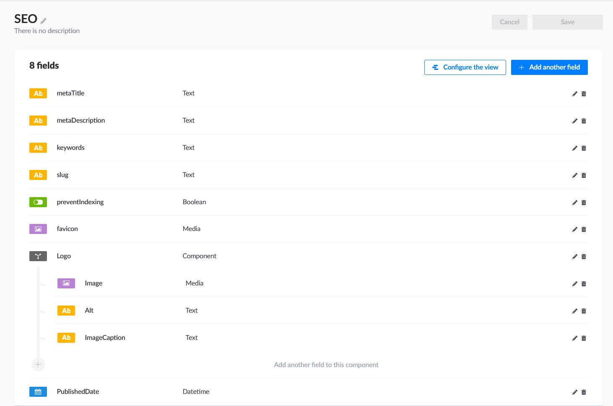
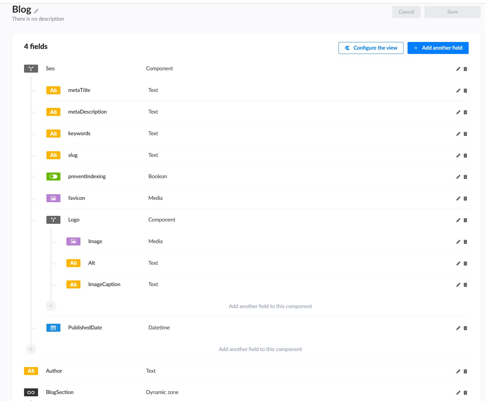
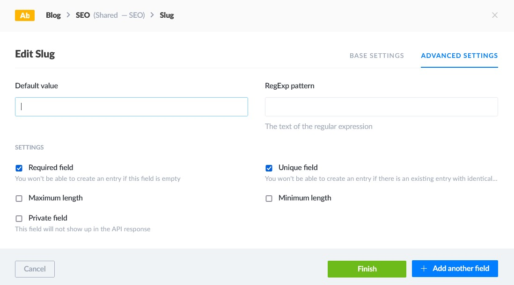

Recently, I've started a series of side hustle projects with my couple of developer friends. 

Since our team was small and everyone was spending their free time, we wanted to make this as less time-consuming as possible. 

Other than creating the whole back end from scratch, we've used Strapi CMS to cover most of the back-end we need for the applications.

Cause I've already experienced Strapi, I was the one in our dev team who insisted to use Strapi. Therefore, I took the whole responsibility for that part of the project.

And in this blog post, I'll summarize how I approached the project in terms of Search Engine Optimization using Strapi. 

## SEO Best Practices

Before getting our feet dirty with Strapi, we should refresh our memories about SEO best practices.
The major purpose of SEO is to improve the ranking of a website/web application in search engine listings.

This can be done using various SEO aspects strategically. So when you want to create content for your website, you must take into account these:

#### 1. Metadata
#### 2. Content Clustering
#### 3. Organized and Structured Data
#### 4. Url Construction

 

### 1. Metadata 
Search engines place a high value on metadata. Metadata is not visible to users (except the title), but they assist search engines in determining the topic of your page.

The most important tags are:
 #### Title: No more than 60 characters and make it at least one word.
 #### Description: No more than 155 characters and try to put essential words respect to your content.
 #### Keywords
 #### Robots: Controls how your material is treated by search engines.

  

    
    
Strapi SEO Component

As you can see picture above, all the metadata fields are created in the SEO component in Stapi, such as metaTitle, metaDescription and the keywords. preventIndexing boolean field is also used for Robots metadata in the project. We set this field to true if we want that particular page indexed by search engines.

Cause of this SEO component used for every collection type that'll render new page in the application, it makes everything very flexible and effective in terms of SEO.

### 2. Content Clustering

Content clustering is an SEO approach that organises content around subjects into pillar and cluster pages to improve a website's structure and internal links.

So that you may link your cluster content to your pillar page which will need to cover each of these themes in general. Each cluster's content can then elaborate on that issue. 

It can be clearly seen how blog pages are important in terms of content clustering for SEO.

We've created blog collection type in this example below and also included SEO component in this collection type.

    
    
Strapi Blog Collection Type

### 3. Organized and Structured Data

Structured data is critical for SEO because it helps search engines in locating and comprehending your content and website. 

It's also a good approach to get ready for the future of search, as Google and other engines continue to personalize the user experience and answer questions right on their Search Engine Results Page.

Organized and Structured Data is directly related to the language that you're using while creating your content. The main goal is your site markup should be universally as understandable as possible.

### 4. Url Construction
For the search engines that will crawl your website, the URLs of your content are quite significant. It is critical to make use of it and while using be as descriptive as possible, that'll help dramatically SEO of your site.

 #### Good Example ==> myrestaurant/menu/foods/spicy-calamari
 #### Bad Example ==> mysrestaurant/menu/foods/232453

It is possible to construct a slug based on the name of your content using Strapi. We've created a slug inside the SEO component which is a short text field, it's required and must be unique while creating the content. 

    
    
Strapi SEO Component Slug Field

### 5. Additional Customized Stuff

If you paid attention to some other fields that we have in SEO component such as favicon, logo, and published date are not needed for SEO purposes. We've added those fields to cover some cases that we needed throughout the application. 

You might need some or you might need completely something different, also making those fields required another developer preference. 

As it's clearly seen Strapi makes everything easier in an organized matter, also you're writing literally zero lines of code. 

However, I'd like to warn you about the major challenge of Strapi projects which is building well-structured components - content type architecture and content type relationships. Other than that, I don't think anything will prevent you to build your dream project.

#### Resources

- [Headless CMS and Strapi SEO best practices](https://strapi.io/blog/headless-cms-strapi-seo-best-practices)

- [How to Create Pages on the fly with Dynamic Zone](https://strapi.io/blog/how-to-create-pages-on-the-fly-with-dynamic-zone?utm_source=devto&utm_medium=post)

