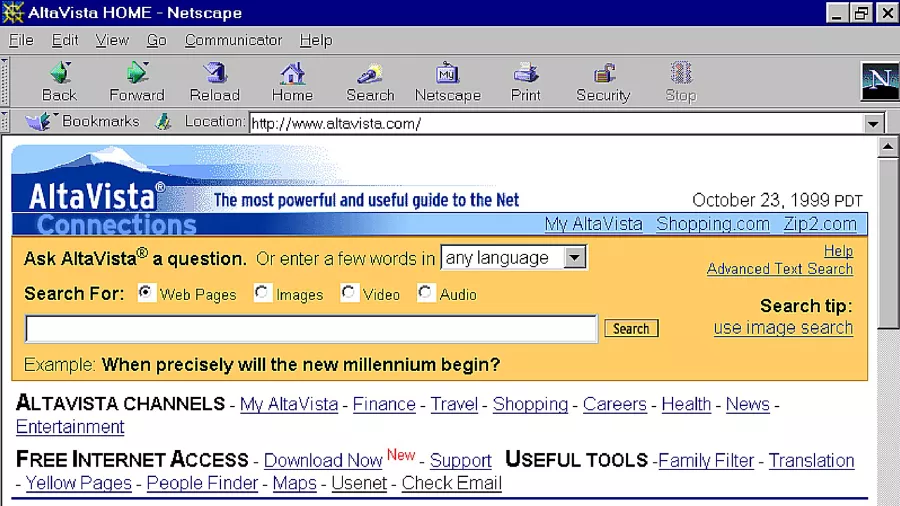
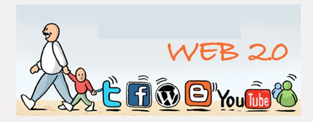
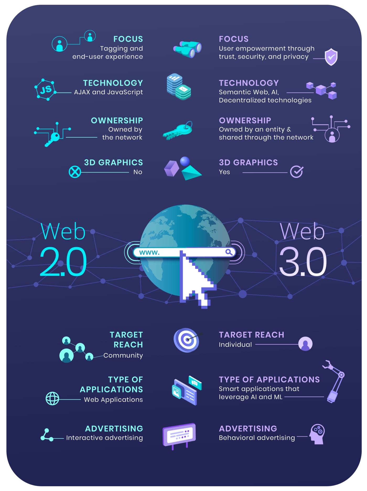
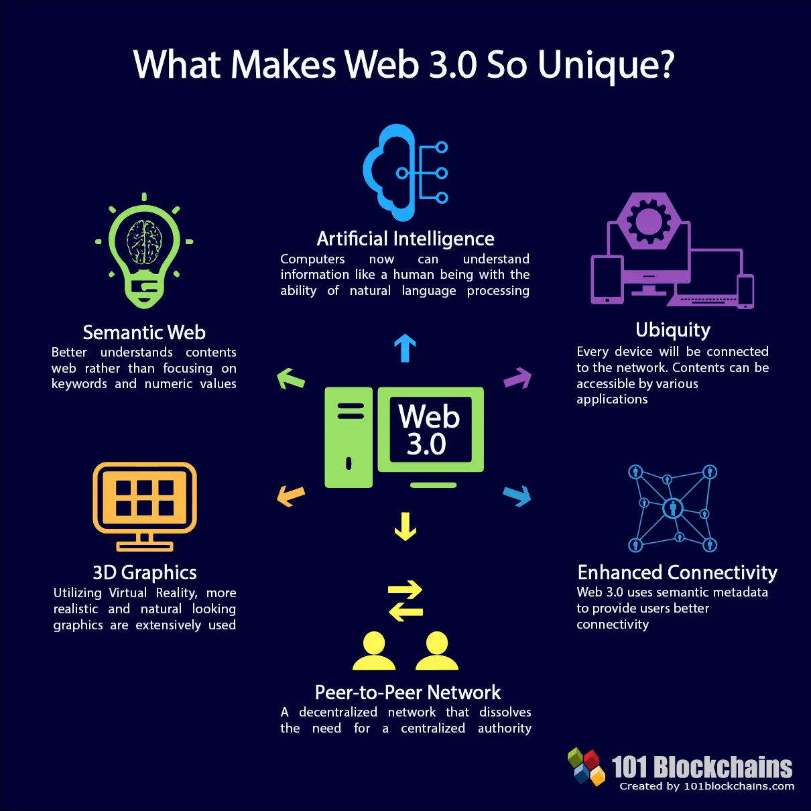

Web 2.0 and Web 3.0 refer to a continuous iteration of the web within the comparison of original Web 1.0 which was carried out in the 1990s by Tim Berners-Lee. The current representation of the internet face is used by Web 2.0, but Web 3.0 congregate as a next phase. 

The process of getting something back from somewhere, as a source of what we called the internet, where the system commonly alludes to the World Wide Web (www). Hence the world interconnects to each other via using www by resources such as hypertext links and information. The significance of these needs creates informative needs among humans what made www develop a more advanced utility. 

## Web 1.0

Three fundamentals were created in early 1990 by Tim Berners-Lee. 

 

    
    
Retrieved from <a style="font-style:italic;" href="https://www.techradar.com/news/internet/web/is-web-1-0-making-a-big-comeback-1291121" target="_blank">Back to basics: is Web 1.0 making a comeback?<a>

#### 1. HTML: Hypertext markup language is the editorial/formatting language of the web.
#### 2. URI or URL: Uniform Resource Identifier or Locator, a unique address used to identify each resource on the web.
#### 3. HTTP: HyperText Transfer Protocol, which allows for the retrieval of linked resources from across the web.

Within the same year’s period, the new browser Netscape Navigator has been introduced to make the source delighted for the new users as the majority of users' main popularity was real-time news retrieval by email. Lately, more advanced resources become very much attractive as an interactive way of using banks and tradings via current platforms.  

 

## Web 2.0
The era of social media, stay connected, and user-generated content took place past 15-20 years. It becomes most required for their users as a connectivity point where 1 billion people can connect streams via the source which allows every user to create their content and share. 

Predominantly, Web 2.0 key elements here were access to mobile devices, social networks, as well as the near-ubiquity of powerful mobile devices like iPhones and Android-powered devices. This developed new applications for some powerful companies such as APPLE, Microsoft, Airbnb and grow their revenues including the opportunity for individuals to make their earnings. 

  

    
    
Retrieved from <a style="font-style:italic;" href="https://commons.wikimedia.org/wiki/File:Web2.0.jpg" target="_blank">Neni ugr, CC BY-SA 4.0, via Wikimedia Commons<a>

## Web 3.0

Web3, often known as Web 3.0, is a concept for a new version of the World Wide Web that combines blockchain-based decentralization.

It's a catch-all word for a variety of concepts aimed at cutting out the big middlemen on the internet. Navigating the web in this new era no longer requires signing up for Facebook, Google, or Twitter.

People in a Web3 world control their own data and use a single anonymous account to go from social media to email to shopping, generating a public record of all of their activities on the blockchain.

Users can engage in the governance and management of the networks directly, rather than merely using free tech platforms in exchange for our data. 

This means that people, not simply customers or things, can become participants and stockholders.

Tokens or cryptocurrencies are the names given to these shares in Web 3, and they reflect ownership of decentralised networks known as blockchains. You can have a say in the network if you own enough of these tokens. Governance token holders can use their funds to vote on the future of a decentralised lending system, for example.

 

    
    
Retrieved from <a style="font-style:italic;" href="https://academy.affinidi.com/web-2-0-vs-web-3-0-a-bridge-between-the-past-and-the-future-c99668c1e2f0" target="_blank">Web 2.0 vs Web 3.0 — A Bridge Between the Past and the Future<a>

## What can Web 3.0 Bring to the Table?

Women, men, machines, and corporations will be able to trade value, information, and collaborate with worldwide counterparties they don't know or explicitly trust without the use of an intermediary thanks to Web 3.0. 

The most significant change permitted by Web3.0 is the reduction of the level of trust necessary for global coordination. This represents a shift toward automatically trusting all network constituents rather than expressly trusting each member and/or seeking to obtain trust extrinsically.

#### 1. From global co-operatives to decentralised autonomous organisations and self-sovereign data marketplaces, this change will open up a whole new world of previously unimaginable companies and corporate models.   

#### 2. Trust providers third parties can be eliminated, and value can be returned directly to consumers and suppliers in a network, making societies more efficient. 

#### 3. Through new mesh of more adaptive peer-to-peer communication and governance ties between members, organisations can be naturally more robust to change. 

#### 4. More data can be shared by humans, businesses, and machines with greater privacy and security assurances.

#### 5. Using established data scarcity and tokenized digital assets, we can own our own data and digital footprints.

 

    
    
Retrieved from <a style="font-style:italic;" href="https://101blockchains.com/web-3-0-blockchain-technology-stack/" target="_blank">Web 3.0 Blockchain Technology Stack: The Comprehensive Guide<a>

## Bottom Line

Analogically, the use of such resources may appear to be as  Web 1.0 black / white tv, Web 2.0 colored / 3d where Web 3.0 evolve to Metaverse. 

As every year it becomes more dominant and reliable for most businesses where the transition from Web 2.0 into Web 3.0 is inevitable and required. 

Here is an example where a renowned company such as Facebook altered their name to Metaverse would well be maintained by Web 3.0 which is still on the high end. 

The transition from Web 2.0 to Web 3.0 could shift gear for other companies to immerse new ways of user activities and connectivity. 

#### Resources

- [Metaverse Definition ](https://www.investopedia.com/metaverse-definition-5206578)

- [Netscape](https://en.wikipedia.org/wiki/Netscape)

- [People are talking about Web3. Is it the Internet of the future or just a buzzword?](https://www.npr.org/2021/11/21/1056988346/web3-internet-jargon-or-future-vision)

- [Tim Berners-Lee](https://www.britannica.com/biography/Tim-Berners-Lee)

- [Web3](https://en.wikipedia.org/wiki/Web3)

- [What Is Web 3 and Why Is Everyone Talking About It?](https://www.coindesk.com/learn/what-is-web-3-and-why-is-everyone-talking-about-it/)

- [What Is Web 3.0 & Why It Matters](https://medium.com/fabric-ventures/what-is-web-3-0-why-it-matters-934eb07f3d2b)

