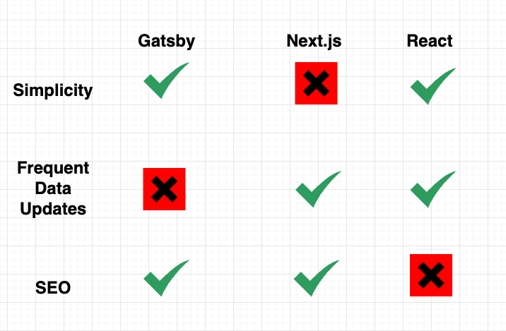

When building a website, I usually use one of three frameworks, [Gatsby](https://www.gatsbyjs.com/), [Next.js,](https://nextjs.org/) or [Create React App](https://reactjs.org/docs/create-a-new-react-app.html). In this article, I want to go over how I choose which one for different projects because I don't think one is strictly better than all the rest, and it just depends and what requirements are for the particular project you're working on.

So to start with, I wanted to mention that it doesn't necessarily have to be these three frameworks you use, and it just depends on the underlying technology or the strategy they use to work.

So what I mean by that is Next.js uses server-side rendering, and you can fill in Next.js as with any server-side rendering framework or your custom server-side rendering. By server-side rendering, the react application will be rendered on the server, which means you'll need a server somewhere that's doing that, and then it will send back the HTML and your react application.

 

    
    
<a style="font-style:italic;" href="https://nextjs.org/" target="_blank">Next.js Official Site<a>

  

In contrast, a client-side rendering is what Create React App uses, and it does the rendering on the client-side so that it will send back a bare-bones HTML file. The rest of the application will be rendered on the client browser, so what that means is if we go to an application that is using Create React App and if we view the source, you'll notice there's like no code in it whatsoever, and the reason for that is it has not been rendered when you view the HTML.

 

    
    
React application HTML file example 

 

When it comes to the Gatsby, I'm putting Gatsby in the static category where it builds all the HTML ahead of time, and then it will render the HTML returning from the server.
You can throw this up on a site like Netlify, a Content Delivery Network, or something that will serve static HTML files; deployment can be pretty easy for Gatsby sites.

[If you're wondering about JamStack Application frameworks such as Gatsby and Next.js, check my other blog post to have an idea.](/blog/get-into-jamstack)

 

    
        
<a style="font-style:italic;" href="https://www.gatsbyjs.com/" target="_blank">Gatsby Official Site<a>

  

## Comparison

I've made a matrix below with three things I think about the project before starting. First is the simplicity or complexity, and when I say simplicity, what I'm talking about is two things how hard is it to develop the application and work with third-party libraries. Also, the complexity of deploying is another consideration factor.

The second most important thing is how often your data in the database is updated, which is an essential aspect of the project stack decision.

The last point in my consideration is how important is Search Engine Optimization (SEO) for the project.

 

    
    
Framework Comparison 

 

### Simplicity

To start with simplicity, I feel like gatsby and Create React App both are pretty simple, and for Next.js, I would say it is behind them for the simplicity aspect.
What I mean by that is with server-side rendering, it's a little bit more complex when dealing with third-party libraries, and just the general development experience of getting things to work usually requires a little additional effort and adding extra code in there to get stuff to work compared to using these two libraries, client-side rendering or static HTML usually seems more straightforward.

When it comes to deployment, it is much easier to deploy React app or Gatsby project because you can just put them up on Netlify or a CDN, and that's it. You pretty much just let them handle the scale. With server-side rendering, you're going to be paying for a lot more; because you will have more servers running to create the content and send that back dynamically. Also, it is more complex to do all that stuff, so if you do not need server-side rendering, you should choose either Create React App or Gatsby.

### Application Data Update Frequency

Our next point is how often data updates are, so Create React App is pretty good at this Gatsby, I would say, is less good, and Next.js, yes, I would say, is pretty good. So what I mean by frequent updates is if you have a site, for example, Reddit, where you have posts, comments up votes that are constantly happening. The data is continuously changing, so your HTML and website are continually updating values, so I say Gatsby is less good in these scenarios.

Because there are two ways to update your Gatsby site, the first way is building the entire site whenever there is a change which is a very valid way to do it. However, if you'll have updates happening many times per second, Gatsby wouldn't be a perfect choice since building the site every second is probably not super viable.

The other way you can do it with Gatsby is just dynamically to fetch the data and render it on the client-side, such as how the Create React App works. Still, if your website is doing a ton of client-side rendering personally, I like using Create React App better than Gatsby for these situations.

However, when you need better SEO for your frequently updating site, this is where Next.js shines. Because when updates happen, it dynamically renders the react application every time so that the updates will come with it.

### SEO

Let's move on to the last point, which is the site's Search Engine Optimization (SEO). Where Next.js and Gatsby are very good, and Create React App is behind them. If you have HTML, that's being sent from the server, which is very good. However, as I've mentioned in the example above, for Create React App, we get nothing back if we view the source of our site example.

If Google can't crawl and parse our application pages to index them in the search results, we will get poor SEO results. The bottom line is you get worse SEO when your project uses Create React App / client-side rendering compare to static site generators and server-side rendering projects.

[Check my blog post that explains SEO best practices for better search engine results.](/blog/seo-best-practices-with-strapi)

### Conclusion

 

    
    
Decision tree 

 

You can break down what I just did into a simple decision tree or ask yourself whether you need good SEO. If you don't, you can immediately choose Create React App. That's usually what I do, and you can ask when you do not need good SEO things like dashboards or any application where it's going to be behind a login wall. I use Create React App as a default for all the critical content that is private and is not public-facing. It just comes down to how often your data updates if you need good SEO.

If your data is constantly updating, I don't think Gatsby is an excellent choice because you're either just going to be building the site many times, which I don't think is a great option. You can dynamically fetch the data in some parts of the application while using Gatsby; however, using Next.js might also be a better decision for this case.
